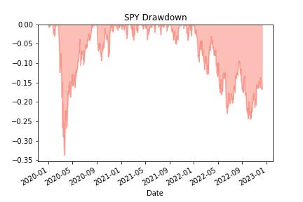
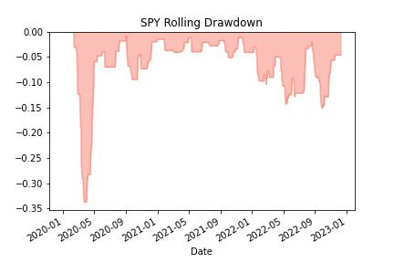

# Compute drawdown on an investment

Drawdown is the maximum decline from peak to trough during a specific period before a new peak is reached. Every trading strategy experiences drawdowns. Computing it helps you compare the relative riskiness between assets or strategies.

Most people don’t consider drawdown when managing their investments. Or if they do, they struggle to compute it.

---

Libraries used:

numpy
yfinance
matplotlib

---

**File:** [Compute Drawdown](computeDrawdown.ipynb)

---

## Step 1: Get the data

We’ll use the yFinance library to get our data

in this example, SPY is used. 
Drawdown is usually computed with the returns of a portfolio. 
To keep it simple, the S&P500 ETF is used.

compute the simple returns of the adjusted close by using the pct_change() function

---

## Step 2: Create the drawdown function

When computing returns, the first value is turned into np.nan. 
Replace it with a 0.0 to compute cumulative returns. 
Then create a cumulative return series which is the cumulative product of 1 plus the return. 
Use NumPy’s accumulate function. Accumulate tracks the running maximum value which is perfect for keeping tabs on the peak return.

Compute the percentage difference between the cumulative and peak returns.

**plot the drawdown**

This chart shows SPY dropping 33.7% from its peak to trough return in 2020.

---

## Step 3: Create a max drawdown function

Use the drawdown to compute a max drawdown chart.
The max drawdown differs from the drawdown by tracking the maximum drawdown of a 30-day rolling window of returns.

max_drawdown applies the drawdown function to 30 days of returns and figures out the smallest (most negative) value that occurs over those 30 days. Then it moves forward one day, computes it again, until the end of the series.

**plot the rolling drawdown**

Drawdown and max drawdown focus on capital preservation. It’s a useful indicator of the riskiness of a stock, portfolio, or strategy. Use it to help manage your risk.